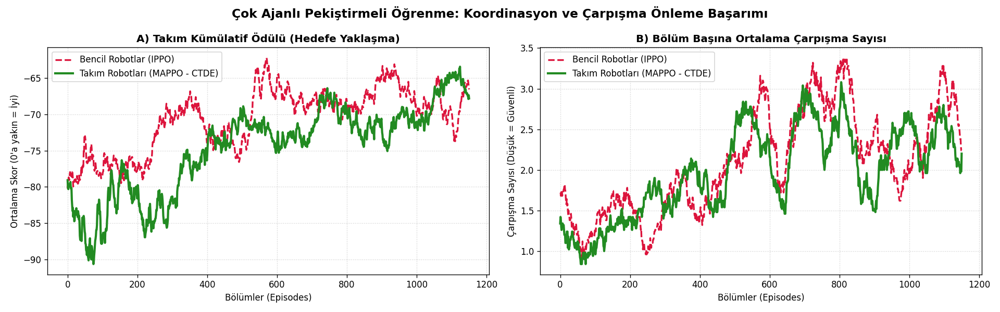
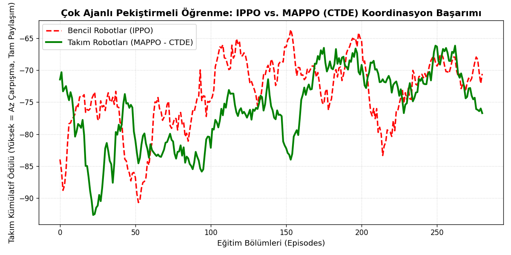

# Multi-Agent Reinforcement Learning: Local vs. Centralized Critic

A PyTorch notebook exploring **Centralized Training with Decentralized Execution (CTDE)** in a cooperative, three-agent navigation task. The experiment compares a critic using an individual agent's observation with a critic using the concatenated observations of all agents.

The project is an educational simulation baseline for studying multi-agent coordination before moving to more detailed autonomous mobile robot or AGV scenarios.

**Method naming:** the original notebook and figures use `IPPO` and `MAPPO` labels. The implemented updates are episodic Actor–Critic updates: they do not include PPO probability ratios, a clipped surrogate objective, or repeated minibatch optimization. In this repository, those labels identify the **local-critic** and **centralized-critic** variants, respectively, rather than complete IPPO/MAPPO implementations.

## Repository contents

| File | Contents |
| --- | --- |
| [Marl_Ctde.ipynb](Marl_Ctde.ipynb) | Network definitions, two training experiments, saved output, plotting, and a GIF rendering cell. |
| [marl_karsilastirma_grafigi.png](marl_karsilastirma_grafigi.png) | Reward comparison from the 300-episode experiment. |
| [marl_tam_karsilastirma.png](marl_tam_karsilastirma.png) | Reward and geometric overlap comparison from the 1,200-episode experiment. |
| [README.md](README.md) | Method description, installation instructions, and interpretation of the saved results. |

The three supplied experiment files are preserved as provided. Plot titles and notebook comments retain their original Turkish wording.

## Task and environment

The notebook uses `mpe2.simple_spread_v3` through the PettingZoo Parallel API. Three agents move toward three landmarks. The environment rewards landmark coverage and penalizes agent collisions; `local_ratio=0.5` mixes the shared coverage reward with each agent's local collision penalty.

| Setting | Value |
| --- | --- |
| Agents / landmarks | 3 / 3 |
| Steps per episode | 25 |
| Observation per actor | 18 values |
| Discrete actions | 5: stay, left, right, down, up |
| Local critic input | 18 values from one agent |
| Centralized critic input | 54 values: concatenated observations of all three agents |
| Discount factor | `gamma = 0.95` |

Each experiment uses **one shared actor** across its three agents and one shared critic. The actor receives only that agent's observation when selecting an action. The centralized critic receives the concatenated observation vector during training; it is not required for action selection.

Both variants receive the same environment reward definition. The Turkish figure labels “Bencil Robotlar” and “Takım Robotları” distinguish the critic variants; they do not indicate different selfish and cooperative reward functions.

## Networks and training

- **Actor:** `18 → 64 → 64 → 5`, with Tanh hidden activations and a categorical action distribution.
- **Local critic:** `18 → 64 → 64 → 1`.
- **Centralized critic:** `54 → 64 → 64 → 1`.
- **Update:** discounted episode returns, a value baseline, policy-gradient actor loss, and squared-error critic loss; one update per episode.
- **Optimizer:** Adam for both networks.

| Setting | Initial experiment | Extended experiment |
| --- | --- | --- |
| Episodes per variant | 300 | 1,200 |
| Actor learning rate | `1e-3` | `7e-4` |
| Critic learning rate | `2e-3` | `1.5e-3` |
| Entropy coefficient | No entropy term | `0.01` |
| Plot moving-average window | 20 episodes | 50 episodes |
| Console reporting window | 50 episodes | 100 episodes |

Although an introductory comment mentions normalization, the current training code does not implement observation, return, or advantage normalization.

## Saved results

### Extended experiment: 1,200 episodes per variant



The final console entries in the supplied notebook report the following averages over **episodes 1,101–1,200**:

| Variant / original label | Mean team episode return ↑ | Mean pair-overlap count per episode ↓ |
| --- | ---: | ---: |
| Local critic / `IPPO` | -68.17 | 2.7 |
| Centralized critic / `MAPPO` | -66.41 | 2.4 |

In this saved run, the centralized-critic variant has a higher final-window return and a lower overlap count. The curves fluctuate and cross during training. These observations come from one unseeded training run; they do not establish statistical superiority or performance on held-out evaluation episodes.

**Metric definitions:**

- **Team episode return:** sum of the rewards of all three agents across all 25 steps. Higher values are better for this reward definition; this is not a success rate.
- **Pair-overlap count:** before each action, the code checks each unordered agent pair and adds one when the distance is below `0.30`. A pair staying within the threshold for several steps contributes several counts. This is a geometric overlap measure, rather than a count of distinct collision events or a physical safety guarantee.

The plot uses 50-episode moving averages, while the table uses the 100-episode reporting window. With `np.convolve(..., mode="valid")`, the plotted horizontal index begins at zero for the first complete averaging window; it is not the exact episode number printed in the log.

### Initial experiment: 300 episodes per variant



This shorter experiment compares training returns with a 20-episode moving average. Its network learning rates differ from the extended experiment, so the two plots should not be treated as one continuous training run.

## Run the notebook

### Google Colab

1. Open [Google Colab](https://colab.research.google.com/) and upload `Marl_Ctde.ipynb`, or open the notebook from its GitHub repository.
2. In a new setup cell, run:

   ```python
   !pip install "mpe2==1.1.1" numpy torch matplotlib imageio ipython
   ```

3. Skip the two original installation cells and run the remaining cells in order, starting with the first `import numpy as np` cell.
4. The notebook trains both variants for 300 episodes, plots their returns, then trains both variants for 1,200 episodes and creates the two-panel plot.
5. Run the final cell after extended training to create and display `robotlar_gorevde.gif` using the trained centralized-critic actor.

The first original cell uses `pettingzoo[mpe]`, which is an outdated installation route. MPE environments now use the separate `mpe2` package. Version `1.1.1` is recorded in the supplied notebook's installation output.

### Local Jupyter

Create a virtual environment:

```bash
python -m venv .venv
```

Activate it with `.venv\Scripts\activate` on Windows, or `source .venv/bin/activate` on Linux/macOS. Then install the dependencies and open the notebook:

```bash
python -m pip install "mpe2==1.1.1" numpy torch matplotlib imageio ipython jupyterlab
jupyter lab Marl_Ctde.ipynb
```

Skip the two original installation cells and execute the training, plotting, and rendering cells in order. The notebook does not move tensors to CUDA, so its current training code runs on CPU even when a GPU is available.

Rerunning the plotting cells writes the two PNG files to the current working directory. The GIF is generated by the final cell and is not included as a separate file in this repository. Trained weights remain in memory and are not saved as model checkpoints.

## Reproducibility and next steps

The notebook stores example output, but does not set random seeds, export raw episode histories, or run a separate evaluation phase. A fresh execution can produce different curves. The provided PNGs are saved artifacts, not newly regenerated results.

Useful extensions include:

- Implement the full PPO update before benchmarking the methods as IPPO and MAPPO.
- Evaluate multiple seeded runs and report mean, spread, and held-out evaluation results.
- Export raw reward/overlap histories and model checkpoints.
- Track distinct collision events and landmark-coverage success separately.
- Extend the scenario with AGV dynamics, obstacles, communication delays, and recovery disturbances.

## References

- [Farama Foundation — MPE2 Simple Spread documentation](https://mpe2.farama.org/environments/simple_spread/)
- [Farama Foundation — MPE migration from PettingZoo to MPE2](https://pettingzoo.farama.org/environments/mpe/)
- [Schulman et al. — Proximal Policy Optimization Algorithms (2017)](https://arxiv.org/abs/1707.06347)

**Author:** Ercan Sevdi
